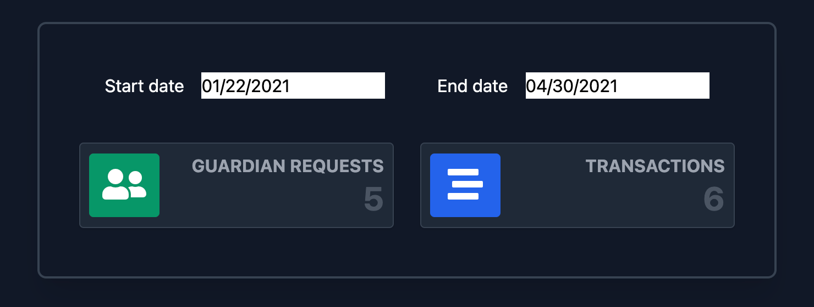

# Argent guardians manager subgraph & small widget



<br />
<br />
Live version is available at https://argent-guardians-stats.vercel.app/

### Built With

* [ReactJS](https://reactjs.org/)
* [Apollo GraphQL](https://www.apollographql.com/docs/react/)
* [Tailwind CSS](https://tailwindcss.com)
* [date-fns](https://date-fns.org)
* [react-day-picker](https://react-day-picker.js.org)

### Installing and running

The subgraph has already deployed and run at https://thegraph.com/explorer/subgraph/enemycnt/argent-guardians-beta

Simply clone the repository

```
git clone git@github.com:enemycnt/argent-guardians-beta.git
cd argent-guardians-beta/argent-guardians-stats
```

then install dependencies

```
yarn install
```

and finally run the app

```
yarn start
```

Open [http://localhost:3000](http://localhost:3000) with your browser to see the result.


